# Workflow State Review — eDoc

**Review date:** 2026-07-01  
**Sources:** `version-0-baseline.md`, `reference/starter.md`, `DATA_MAP.md`, `database/migrations/0001_initial.sql`, `src/utils/routingRules.ts`, `src/types/domain.ts`

**Note:** Status enums below reflect **recommended normalized values** after resolving CONF-003 (`awaiting_my_action` → remove from document status; use query-based inbox filter).

---

## 1. Document Status

### Current proposed statuses (baseline)

```text
draft | preparing | ready_for_routing | in_routing | awaiting_action
returned | rejected | completed | cancelled | expired | archived
```

### Recommended document status definitions

| Status | Meaning | Entry trigger |
|---|---|---|
| `draft` | Metadata only; no file or incomplete | Document created |
| `preparing` | File uploaded; field placement in progress | Upload complete |
| `ready_for_routing` | Wizard complete; not yet sent | Owner completes preparation |
| `in_routing` | Active route; at least one step not terminal | Owner sends route |
| `awaiting_action` | Route active; current step waiting on assignee(s) | Step activated (may overlap `in_routing`) |
| `returned` | Revision requested; owner must revise | Return action |
| `rejected` | Terminal rejection | Reject with terminate policy |
| `completed` | All required steps done; certificate optional | Final step completes |
| `cancelled` | Owner/admin cancelled before completion | Cancel action |
| `expired` | Past expiry date without completion | System job |
| `archived` | Retention/archive applied | Retention job or admin |

**Clarification:** `awaiting_action` vs `in_routing` — recommend **`in_routing` as parent state** and derive "awaiting action" for dashboards via assignee pending queries, **or** use `awaiting_action` only when current step is active and waiting. Pick one model in baseline (recommend: keep both with rule: `in_routing` ⊃ `awaiting_action` when pending assignee exists).

### Document state transition table

| From | To | Trigger | Actor | Permission | Audit event | Transaction |
|---|---|---|---|---|---|---|
| — | `draft` | Create document | Owner | `document.create` | `document.created` | Insert doc |
| `draft` | `preparing` | Start upload/prep | Owner | `document.edit` | `document.preparation_started` | Update status |
| `preparing` | `ready_for_routing` | Complete wizard prep | Owner | `document.edit` | `document.ready` | Update status |
| `ready_for_routing` | `in_routing` | Send route | Owner | `route.send` | `route.started` | Create route + steps |
| `in_routing` | `awaiting_action` | Activate step | System/Worker | — | `route.step_activated` | Step update |
| `awaiting_action` | `in_routing` | Step completes, more steps remain | Worker | — | `route.step_completed` | Advance |
| `in_routing` | `completed` | Final step completes | Worker | — | `document.completed` | Route complete + cert |
| `*` (pre-complete) | `returned` | Return for revision | Assignee | assignment action | `document.returned` | New version cycle start |
| `returned` | `preparing` | Owner starts revision | Owner | `document.edit` | `document.revision_started` | New version row |
| `*` (pre-complete) | `rejected` | Reject (terminate) | Assignee | assignment action | `document.rejected` | Terminal route |
| `*` (pre-complete) | `cancelled` | Cancel | Owner/Admin | `document.cancel` | `document.cancelled` | Invalidate pending |
| `in_routing` | `expired` | Past due_at/expiry | System | — | `document.expired` | Scheduled job |
| `completed` | `archived` | Retention policy | System/Admin | `document.archive` | `document.archived` | Read-only |

### Invalid document transitions

| From | To | Reason |
|---|---|---|
| `completed` | `draft` | Completed versions immutable |
| `completed` | `in_routing` | Must create new document or new major workflow |
| `rejected` | `in_routing` | Terminal unless admin override with audit |
| `archived` | any non-archived | Requires admin restore policy (undefined — **gap**) |
| `expired` | `in_routing` | Requires explicit reopen override (**gap**) |
| `cancelled` | `in_routing` | Requires new route (**gap**) |

### Missing transitions (require baseline decision)

- Admin **reopen** from `rejected` / `expired` / `cancelled`
- `returned` → `ready_for_routing` without new file (metadata-only fix)
- Automatic `awaiting_action` ↔ `in_routing` synchronization rules

---

## 2. Document Version Status

### Proposed statuses (draft SQL)

```text
draft | active | superseded | completed | void
```

| From | To | Trigger | Actor | Audit |
|---|---|---|---|---|
| — | `draft` | Version created | Owner | `version.created` |
| `draft` | `active` | Route sent on this version | Owner/Worker | `version.activated` |
| `active` | `superseded` | New version created after return | Owner/Worker | `version.superseded` |
| `active` | `completed` | Route completes on this version | Worker | `version.completed` |
| `draft` | `void` | Wizard abandoned / cancel draft | Owner | `version.voided` |

**Invalid:** `completed` → `draft`; `superseded` → `active`

**Rule:** Signatures bind only to `active` or `completed` versions, never `superseded`.

---

## 3. Route Status

### Proposed statuses (draft SQL)

```text
draft | active | completed | rejected | returned | cancelled | expired
```

| From | To | Trigger | Actor | Permission | Audit |
|---|---|---|---|---|---|
| — | `draft` | Route configured in wizard | Owner | `route.create` | `route.created` |
| `draft` | `active` | Send document | Owner | `route.send` | `route.started` |
| `active` | `completed` | All steps satisfy completion rules | Worker | — | `route.completed` |
| `active` | `rejected` | Terminating rejection | Assignee | step action | `route.rejected` |
| `active` | `returned` | Return for revision | Assignee | step action | `route.returned` |
| `active` | `cancelled` | Cancel | Owner/Admin | `route.cancel` | `route.cancelled` |
| `active` | `expired` | Expiry job | System | — | `route.expired` |

**Invalid:** `completed` → `active`; `rejected` → `active` (without override)

**Transaction requirement:** Route status change + document status change + assignee invalidations in **one database transaction** via Worker.

---

## 4. Route Step Status

### Proposed statuses (draft SQL + routingRules)

```text
pending | active | completed | rejected | returned | skipped | invalidated
```

| From | To | Trigger | Actor | Audit |
|---|---|---|---|---|
| `pending` | `active` | Prior sequential step completes OR parallel group starts | Worker | `step.activated` |
| `active` | `completed` | Completion rule satisfied | Worker | `step.completed` |
| `active` | `rejected` | Assignee rejects (terminate) | Assignee | `step.rejected` |
| `active` | `returned` | Assignee returns | Assignee | `step.returned` |
| `pending` | `skipped` | Authorized override | Admin | `step.skipped` |
| `*` | `invalidated` | New document version supersedes | Worker | `step.invalidated` |

### Sequential activation (current code)

`getNextActiveSteps('sequential')` returns first `pending` step only.  
`getNextActiveSteps('parallel')` returns all `pending` steps.

**Gap:** `mixed` mode not implemented — requires parallel groups within sequence numbers.

### Completion rules

| Rule | requiredCount logic |
|---|---|
| `all` | All assignees must complete |
| `any` | 1 completion |
| `majority` | floor(N/2)+1 (pending DEC-020) |
| `minimum_count` | `minimum_count` field from step |

---

## 5. Assignee (Route Step Assignee) Status

### Proposed statuses (draft SQL)

```text
pending | active | completed | rejected | returned | delegated | invalidated
```

| From | To | Trigger | Actor | Audit |
|---|---|---|---|---|
| `pending` | `active` | Step activated | Worker | `assignee.activated` |
| `active` | `completed` | Action submitted successfully | Assignee/Worker | `assignee.completed` |
| `active` | `rejected` | Reject | Assignee | `assignee.rejected` |
| `active` | `returned` | Return | Assignee | `assignee.returned` |
| `active` | `delegated` | Delegate to another user | Assignee | `delegation.created` |
| `delegated` | `active` | Delegate accepts (if acceptance required) | Delegate | `delegation.accepted` |
| `*` | `invalidated` | Version superseded / route cancelled | Worker | `assignee.invalidated` |

**Gap:** Delegation flow (acceptance required?, can delegate to non-org user?) undefined.

---

## 6. Signature Transaction Status

Not persisted in draft SQL — **recommended new enum** on signing attempts:

```text
initiated | reauth_pending | reauth_passed | hashing | applying_signature
storing | recording | advancing | completed | failed | rolled_back
```

### Signature transaction flow

```mermaid
stateDiagram-v2
    [*] --> initiated: User clicks Sign
    initiated --> reauth_pending: Prompt re-auth
    reauth_pending --> reauth_passed: Re-auth OK
    reauth_pending --> failed: Re-auth fail
    reauth_passed --> hashing: Verify document hash
    hashing --> applying_signature: Hash match
    hashing --> failed: Hash mismatch
    applying_signature --> storing: PDF generated
    storing --> recording: R2 put OK
    storing --> rolled_back: R2 fail
    recording --> advancing: DB events inserted
    recording --> rolled_back: DB fail
    advancing --> completed: Route advanced
    advancing --> rolled_back: Advance fail
    completed --> [*]
    failed --> [*]
    rolled_back --> [*]
```



| Step | Rollback behavior |
|---|---|
| Re-auth fail | No state change; audit `signature.failed` |
| Hash mismatch | No PDF change; audit failure |
| R2 put fail | Delete partial object if created; no signature_event |
| DB insert fail | Delete R2 object; no route advance |
| Advance fail | Signature recorded but route flag `advance_pending` — **requires decision** (prefer full rollback) |

**Duplicate submission:** Same `Idempotency-Key` returns original `signature_event` response without re-processing.

---

## 7. Cross-Entity Consistency Rules

1. Document `completed` ⇒ route `completed` ⇒ all required steps `completed` or `skipped`.
2. Document `returned` ⇒ route `returned` or new route on new version — **decision needed**.
3. Assignee `completed` for sign action ⇒ `signature_event` row exists for same version_id.
4. `signature_event` created ⇒ immutable audit event with matching hash.
5. Version `superseded` ⇒ all assignees on that version `invalidated`.

---

## 8. Error and Rollback Summary

| Operation | On failure | User message | Audit |
|---|---|---|---|
| Send route | Rollback route + step inserts | Structured error + requestId | None or `route.send_failed` |
| Sign | Full rollback preferred | No partial success implied | `signature.failed` |
| Advance | Rollback step changes | Retry safe with idempotency | `route.advance_failed` |
| Upload complete | No document_version file row | Validation error | `upload.failed` |

---

## 9. Administrative Override (partially defined)

| Action | Precondition | Result | Required |
|---|---|---|---|
| Skip required step | Admin/controller permission | Step → `skipped` | Reason + audit |
| Force complete | Admin + document controller | Route → `completed` | Reason + audit |
| Reassign assignee | Admin or owner | New assignee row | Audit |

**Gap:** Override permissions not mapped to permission keys.

---

## 10. Recommendations

1. Add baseline appendix with these tables after owner resolves DEC-006, DEC-007, DEC-008.
2. Remove `awaiting_my_action` from persisted document status.
3. Implement `mixed` routing as sequential groups of parallel steps (sequence + group_id).
4. Add `signing_transactions` table or equivalent for in-flight signature state and idempotency.
5. Define admin reopen/archive-restore as explicit decisions or permanent prohibitions.
